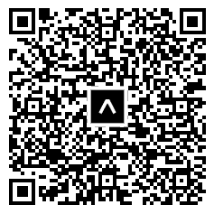

# Medication Reminder

A mobile application for Android and IOS built with React Native and Expo that helps users manage their daily medications. The app uses barcode scanning to simplify adding new medicines and builds a local, self-learning database that gets smarter with every use.

##  Try It

No setup needed, just scan the QR code with the **Expo Go** app ([iOS](https://apps.apple.com/app/expo-go/id982107779) / [Android](https://play.google.com/store/apps/details?id=host.exp.exponent)):

<p align="center">
  
</p>

## Features

- **Barcode Scanner** - Scan medicine boxes with your phone's camera to auto-fill medication details
- **Self-Learning Database** - Unknown barcodes are saved locally after the first manual entry, so they auto-fill next time
- **Medication Tracking** - Mark doses as "Taken" or "Missed" with a single tap
- **Edit & Delete** - Update medication details or remove them via an inline menu on each card
- **Schedule Picker** - Set frequency (Daily, Twice a Day, Weekly, etc.) and time using dropdown selectors instead of typing
- **Offline-First** - All data is stored locally on the device using AsyncStorage. No internet required, no cloud accounts

## Tech Stack

| Technology | Purpose |
|---|---|
| React Native + Expo | Cross-platform mobile framework |
| TypeScript | Type-safe codebase |
| expo-camera | Barcode scanning (EAN-13, UPC-A, etc.) |
| AsyncStorage | Local data persistence |
| Expo Router | File-based navigation |

## For Developers

If you want to run the project locally:

### Prerequisites

- [Node.js](https://nodejs.org/) (v18+)
- [Expo Go](https://expo.dev/go) app on your phone

### Installation

```bash
# Clone the repository
git clone https://github.com/ASmallBurger/medication-reminder

cd MedicationReminder

# Install dependencies
npm install

# Start the server
npm start
```

Scan the generated QR code in your terminal with Expo Go to open the app on your device.

## Project Structure
Here is a breakdown of where everything is:

- **`app/`** -- The main screens and navigation routes.
  - `(tabs)/index.tsx` is the home screen that shows all your meds.
  - `(tabs)/two.tsx` is the full scanner and manual entry form.
- **`components/`** -- Reusable UI parts.
  - `MedicationCard.tsx` handles the display, editing, and deleting of each medicine.
  - `SchedulePicker.tsx` is the custom dropdown for picking times and frequencies.
- **`Data/`** -- Where the database lives.
  - `database.ts` handles saving to AsyncStorage and the self-learning barcode logic.
- **`assets/`** -- Static files like images, fonts.


## How Barcode Scanning Works

1. The camera scans a barcode and reads the number (e.g. `5017848251xxx`)
2. The app checks a built-in starter database and then user-saved barcodes in local storage
3. **If found ->** Name and dosage auto-fill into the form
4. **If not found ->** User enters details manually. On save, the barcode is permanently linked to those details for future scans

## Known Limitations

- **Push Notifications**: Background reminders cannot be triggered while running inside Expo Go, as it operates as a sandbox. A standalone build via EAS would be required for production notifications
- **Barcode Coverage**: The built-in database contains a small starter set. The self-learning feature expands coverage over time as the user scans new medicines

##
This project was developed as a Final Year Project for my university.
